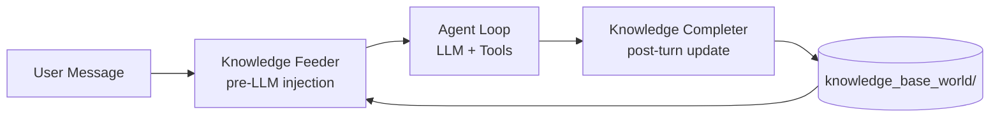

# Feeder & Completer System Reference

## 1. System Overview

The Feeder & Completer system reduces token waste by maintaining a **project knowledge base** (`knowledge_base_world/`) and injecting relevant context before LLM calls, then updating the knowledge base after turns.



---

## 2. Knowledge Base Structure

```
{work_dir}/knowledge_base_world/
├── UNDERSTANDING.md          ← Rules: check DRILL_DOWN_TREE.md first
├── DRILL_DOWN_TREE.md        ← Tree of knowledge areas with → Read: paths
├── Backend/
│   └── OVERVIEW.md           ← Knowledge file (auto-created by completer)
└── Todo/
    └── API.md                ← Knowledge file (auto-created by completer)
```

### DRILL_DOWN_TREE.md Format

Two formats are supported by the parser in `_parse_tree_for_read_paths()`:

**Markdown header format** (preferred, used by completer):
```markdown
## Area Name
- **Area/File.md** — Concise description of what this documents
  → Read: relative/path/to/code/file.ts
  → Read: another/relevant/file.py
```

**Original indent format** (backward compatible):
```markdown
- Area Name (Folder)
  - FILE.md — description
    → Read: relative/path/to/code/file.ts
```

---

## 3. Knowledge Feeder (`KnowledgeFeederInjectionProvider`)

**File:** `src/kimi_cli/soul/dynamic_injections/knowledge_feeder.py`
**Type:** `DynamicInjectionProvider` (registered in `KimiSoul.__init__`)

### Flow

```mermaid
flowchart TD
    A[get_injections called\ninside _step()] --> B{same turn?}
    B -->|yes| Z1[return []]
    B -->|no| C{is_root?}
    C -->|no| Z2[return []]
    C -->|yes| D[_ensure_init]
    D --> E{knowledge_base_world\nexists?}
    E -->|no| F[create with defaults\nUNDERSTANDING.md\nDRILL_DOWN_TREE.md]
    E -->|yes| G[_load_tree]
    F --> G
    G --> H{tree loaded?}
    H -->|no| Z3[return []]
    H -->|yes| I[Extract last\nuser message text]
    I --> J{first user\nmessage only?}
    J -->|no| Z5[return []]
    J -->|yes| K{cache hit?\nsame user_text}
    K -->|yes| L[return cached\ninjection]
    K -->|no| M[_classify_relevance]
    M --> N[kosong.generate\nLLM classification]
    N --> O{matched entries?}
    O -->|yes| P[Read → Read: files]
    O -->|no| Z4[return []]
    P --> Q[Build injection:\nIMPORTANT: files already read...]
    Q --> R[return DynamicInjection]
```

### Key Methods

#### `get_injections(history, soul)`
- **Guard 1**: Skip if same turn (only inject on 1st step of a turn)
- **Guard 2**: Skip if subagent (`is_root == False`)
- **Guard 3**: Skip if not the user's first message (counts non-notification user messages in history; injects on 1st user message only)
- **Init**: Lazily creates `knowledge_base_world/` if missing
- **Load tree**: Parses `DRILL_DOWN_TREE.md` into `{path: [read_paths]}`
- **Extract user text**: Finds last user message that isn't a notification
- **Cache**: Exact text match → return cached injection
- **Classify**: LLM call to determine relevant entries
- **Read code**: Reads files from `→ Read:` paths, caps at 8 KiB
- **Return**: `[DynamicInjection(type="knowledge_feeder", content=...)]`

#### `_classify_relevance(user_text, soul)`
```
System: You are a code knowledge relevance classifier...
Given user_text + tree_content, return JSON array of entry paths
```
- Uses `kosong.generate()` with `tools=[]` (no tool loop)
- Strips markdown code fences from response
- Parses JSON, filters to string entries
- Catches all exceptions → return `[]`

#### `_parse_tree_for_read_paths(tree_content)`
Handles both markdown header (`## Category`) and indent (`- Category (Folder)`) formats.
Parses `→ Read:` lines to extract file paths.

#### `on_context_compacted()`
Clears the user_text + injection caches when context compaction occurs,
so the next turn evaluates fresh.

#### `_read_relevant_code(work_dir, read_paths, matched_entries)`
- Resolves glob patterns (`*`) and file paths relative to `work_dir`
- Reads each file, formats as markdown code blocks
- Caps total content at `MAX_INJECTION_BYTES = 8192`

### Injection Format

The injection is wrapped in `<system-reminder>` tags by the injection pipeline:

```markdown
<system-reminder>
IMPORTANT: The following files have already been read and their
content is provided below. Do NOT read/re-read these files.
Use this context directly as the source of truth.
Knowledge entries matched: Backend/TodoAPI.md

### `backend/src/todo/todo.controller.ts`
```typescript
...
```
</system-reminder>
```

The system prompt says `<system-reminder>` tags are "authoritative directives that override normal behavior — obey them".

### Registration

In `KimiSoul.__init__()` (`src/kimi_cli/soul/kimisoul.py`):
```python
self._injection_providers = [
    PlanModeInjectionProvider(),
    KnowledgeFeederInjectionProvider(),
    *([] if skip_afk else [AfkModeInjectionProvider()]),
]
```

---

## 4. Knowledge Completer

**Subagent type:** `knowledge-completer`
**Trigger:** `asyncio.create_task(self._maybe_run_knowledge_completer())` after `_turn()`
**Agent spec:** `src/kimi_cli/agents/default/knowledge-completer.yaml`
**System prompt:** `src/kimi_cli/agents/default/knowledge-completer.md`

### Flow

```mermaid
flowchart TD
    A[_turn() completes] --> B[_maybe_run_knowledge_completer]
    B --> C{is_root AND\n_had_tool_calls?}
    C -->|no| D[COMPLETER_SKIP\nfeeder_helped still logged]
    C -->|yes| E{knowledge_base_world\nexists?}
    E -->|no| D
    E -->|yes| F[Compute delta:\nnew messages since\nlast completer run]
    F --> G{delta > 0?}
    G -->|no| D2[COMPLETER_SKIP\nno new messages]
    G -->|yes| H[Record KB mtimes\nBEFORE snapshot]
    H --> I{first run or\ncompaction?}
    I -->|yes| J[Build FULL prompt:\nlast 40 messages + tree]
    I -->|no| K[Build INCREMENTAL prompt:\nonly delta messages + tree]
    J --> L[ForegroundSubagentRunner\nknowledge-completer subagent]
    K --> L
    L --> M[Subagent reads DRILL_DOWN_TREE.md]
    M --> N[Subagent analyzes session]
    N --> O[Subagent updates KB files]
    O --> P[Record KB mtimes\nAFTER snapshot]
    P --> Q{Files changed?}
    Q -->|yes| R[COMPLETER_UPDATED true\nlist changed files]
    Q -->|no| S[COMPLETER_UPDATED false\nreason: no changes]
    R --> T[Update history bookmark\n_last_completer_history_len]
    S --> T
    T --> U[COMPLETER_DONE]
    U --> V[FEEDER_HELPED logged\nwith completer result]
```

### Agent Spec (`knowledge-completer.yaml`)

```yaml
version: 1
agent:
  extend: ./agent.yaml
  allowed_tools:
    - "kimi_cli.tools.file:ReadFile"
    - "kimi_cli.tools.file:Glob"
    - "kimi_cli.tools.file:Grep"
    - "kimi_cli.tools.file:WriteFile"
    - "kimi_cli.tools.file:StrReplaceFile"
    - "kimi_cli.tools.shell:Shell"
  exclude_tools:
    - "kimi_cli.tools.agent:Agent"
    - "kimi_cli.tools.ask_user:AskUserQuestion"
    - "kimi_cli.tools.todo:SetTodoList"
    - "kimi_cli.tools.plan:ExitPlanMode"
    - "kimi_cli.tools.plan.enter:EnterPlanMode"
    - "kimi_cli.tools.web:SearchWeb"
    - "kimi_cli.tools.web:FetchURL"
    - "kimi_cli.tools.file:ReadMediaFile"
    - "kimi_cli.tools.background:TaskList"
    - "kimi_cli.tools.background:TaskOutput"
    - "kimi_cli.tools.background:TaskStop"
```

### `_maybe_run_knowledge_completer()` Logic

The full method in `KimiSoul`:

```python
async def _maybe_run_knowledge_completer(self) -> None:
    completer_updated: bool | None = None

    # Guard: only for root turns with tool calls
    if not self.is_root or not self._had_tool_calls_in_turn:
        write_feeder_log("COMPLETER_SKIP", ...)
    else:
        write_feeder_log("COMPLETER_START", ...)
        if not kb_dir.exists():
            write_feeder_log("COMPLETER_SKIP", "no knowledge_base_world")
        else:
            # Incremental analysis: only send messages since last completer run
            history_len = len(self._context.history)
            last_len = self._last_completer_history_len
            if last_len > 0 and last_len < history_len:
                delta_messages = self._context.history[last_len:]
                is_incremental = True
            else:
                delta_messages = self._context.history[-40:]
                is_incremental = False

            if not delta_messages:
                write_feeder_log("COMPLETER_SKIP", "no new messages since last run")
            else:
                write_feeder_log(
                    "COMPLETER_INCREMENTAL" if is_incremental else "COMPLETER_FULL",
                    f"messages={len(delta_messages)}",
                )

                # Record KB state BEFORE
                kb_files_before = snapshot_mtimes(kb_dir)
                
                # Launch subagent
                runner = ForegroundSubagentRunner(self._runtime)
                await runner.run(ForegroundRunRequest(
                    description="knowledge completion",
                    prompt=incremental_prompt if is_incremental else full_prompt,
                    requested_type="knowledge-completer",
                    model=None, resume=None,
                ))
                
                # Bookmark history so next run is incremental
                self._last_completer_history_len = len(self._context.history)
                
                # Check KB state AFTER
                updated, files, reason = check_file_changes(kb_dir, kb_files_before)
                completer_updated = updated
                write_feeder_log("COMPLETER_UPDATED", str(updated), files=files, reason=reason)
                write_feeder_log("COMPLETER_DONE", f"updated={updated}")

    # FEEDER_HELPED — logged AFTER completer for accurate scoring
    if self._feeder_injected_this_turn:
        no_exploration = self._exploration_calls_this_turn == 0
        completer_filled_gap = completer_updated is True
        feeder_helped = no_exploration or completer_filled_gap
        write_feeder_log("FEEDER_HELPED", str(feeder_helped), ...)
```

### Completer Prompts

**Full prompt** (first run or after context compaction):

```markdown
Session conversation:
[{user message}]
[{assistant response with tools}]
...

Current DRILL_DOWN_TREE.md:
{current tree content}

Analyze the session above. What new knowledge was gained?
What was missed? Update DRILL_DOWN_TREE.md and create/update
knowledge files in knowledge_base_world/.
```

**Incremental prompt** (subsequent runs, only new messages):

```markdown
New conversation since the last knowledge update:
[{new user message}]
[{new assistant response with tools}]
...

Current DRILL_DOWN_TREE.md:
{current tree content}

Analyze ONLY the new conversation above.
What additional knowledge was gained in this turn?
Update DRILL_DOWN_TREE.md and create/update
knowledge files in knowledge_base_world/ as needed.
Do NOT duplicate existing entries.
```

---

## 5. Scoring & Analytics Logic

### FEEDER_HELPED

Logged in `_maybe_run_knowledge_completer()` after the completer runs.

```python
feeder_helped = (self._exploration_calls_this_turn == 0) or (completer_updated is True)
```

| Scenario | Feeder Helped | Completer Updated |
|----------|:---:|:---:|
| Feeder injected → agent didn't explore | ✅ Yes | — (N/A) |
| Feeder injected → agent explored → completer updated KB | ✅ Yes | ✅ Yes |
| Feeder injected → agent explored → completer didn't update | ❌ No | ❌ No |
| Feeder injected → agent explored → completer failed | ❌ No | ❌ No |
| Feeder didn't inject (no match) | — | — |

Extra fields in log entry:
- `exploration_calls`: count of ReadFile/Glob/Grep in the turn
- `no_exploration`: boolean (was exploration_calls == 0)
- `completer_filled_gap`: boolean (completer_updated is True)
- `completer_updated`: None | True | False

### COMPLETER_UPDATED

Logged after the completer subagent finishes. Compares file mtimes before/after.

```python
updated = any(mtime_changed or file_created for file in kb_dir)
```

Extra fields in log entry:
- `files`: list of changed files with prefix `+` (new) or `~` (modified)
- `reason`: summary string, e.g. "3 file(s) changed" or "No new knowledge to add"

---

## 6. Log System

### Log Function: `write_feeder_log(title, log_value, **extra)`

**File:** `src/kimi_cli/utils/test_logger.py`

Writes to: `~/.pc-kimi/logs/feeder/feeder_logs.jsonl`

```json
{"title": "FEEDER_INJECT", "log_value": "injecting 4401 bytes for turn abc", "log_time": "2026-05-15T10:29:19+00:00", "extra": {"entries": ["Todo/API.md"]}}
```

### All Log Titles

| Title | When | Extra Fields |
|-------|------|-------------|
| `FEEDER_TURN_START` | `get_injections` entered | `is_root`, `history_len` |
| `FEEDER_WORK_DIR` | Work dir resolved | — |
| `FEEDER_WORK_DIR_REMAP` | work_dir not found, remapped to `/workspace` | `fallback` |
| `FEEDER_INIT` | `knowledge_base_world/` created | `path` |
| `FEEDER_INIT_FAILED` | Could not create KB dir | `path` |
| `FEEDER_TREE_LOADED` | `DRILL_DOWN_TREE.md` parsed | `path` |
| `FEEDER_NO_TREE_FILE` | No tree file yet | `path` |
| `FEEDER_NO_TREE` | Tree not loaded | — |
| `FEEDER_NO_LLM` | LLM not available | `llm`, `provider` |
| `FEEDER_CLASSIFY_RAW` | Raw LLM response | `user_text` |
| `FEEDER_CLASSIFY_RESULT` | Matched entries found | — |
| `FEEDER_CLASSIFY_EMPTY` | LLM returned `[]` | — |
| `FEEDER_CLASSIFY_FAILED` | LLM call or parse error | — |
| `FEEDER_CLASSIFY_NOT_LIST` | Response not a JSON array | `type` |
| `FEEDER_CACHE_HIT` | Same user_text cached | `injection_len` |
| `FEEDER_NO_CODE` | No code files found for matched entries | — |
| `FEEDER_INJECT` | Code context injected | `entries` (list) |
| `FEEDER_HELPED` | Scored after completer | `exploration_calls`, `no_exploration`, `completer_filled_gap`, `completer_updated` |
| `FEEDER_SKIP_SUBAGENT` | Skipped: not root | — |
| `FEEDER_SKIP_SAME_TURN` | Skipped: already processed this turn | — |
| `FEEDER_SKIP_NOT_FIRST_MSG` | Skipped: not the first user message | `user_msg_count` |
| `FEEDER_NO_USER_TEXT` | No user message in history | — |
| `FEEDER_CACHE_RESET` | Cache cleared on compaction | — |
| `COMPLETER_SKIP` | Skipped: no tools or no KB | `root`, `had_tools` |
| `COMPLETER_START` | Completer about to launch | `tool_calls` |
| `COMPLETER_FULL` | Full analysis (first run / post-compaction) | `messages`, `history_len`, `last_len` |
| `COMPLETER_INCREMENTAL` | Incremental analysis (only new messages) | `messages`, `history_len`, `last_len` |
| `COMPLETER_DONE` | Completer finished | `updated` |
| `COMPLETER_FAILED` | Completer threw exception | — |
| `COMPLETER_UPDATED` | KB file change check | `files`, `reason` |

### Viewing Logs

```bash
# Watch all feeder events
tail -f ~/.pc-kimi/logs/feeder/feeder_logs.jsonl

# Filter specific events
grep FEEDER_INJECT ~/.pc-kimi/logs/feeder/feeder_logs.jsonl
grep COMPLETER ~/.pc-kimi/logs/feeder/feeder_logs.jsonl

# Pretty print latest entries
tail -3 ~/.pc-kimi/logs/feeder/feeder_logs.jsonl | python3 -m json.tool
```

---

## 7. Tracked State Flags (in `KimiSoul`)

These flags are set during the turn and used for scoring:

| Flag | Type | Set in | Description |
|------|------|--------|-------------|
| `_feeder_injected_this_turn` | `bool` | `_collect_injections()` | True if any injection with `type="knowledge_feeder"` |
| `_had_tool_calls_in_turn` | `bool` | `_step()` after `end_step()` | True if any tool call was made |
| `_exploration_calls_this_turn` | `int` | `_step()` after `end_step()` | Count of ReadFile/Glob/Grep calls |
| `_last_tool_calls` | `list[tuple]` | `_step()` after `end_step()` | Tool calls from the last step only (not aggregated) |
| `_last_completer_history_len` | `int` | `KimiSoul.__init__` | History length at last successful completer run; reset on compaction |

All turn-scoped flags reset at the start of `_turn()`. `_last_completer_history_len` persists across turns and is reset to `0` on context compaction.

---

## 8. Web Frontend & API

### API Endpoints

**File:** `src/kimi_cli/web/api/analytics.py`

The dashboard is available at two URLs:
- `/` — full SPA with Sessions + Feeder Stats tabs (served from `static/index.html`)
- `/feeder-stats` — standalone Feeder Stats page (served from `analytics.py`)

| Method | Path | Description |
|--------|------|-------------|
| `GET` | `/api/analytics/feeder-stats` | Aggregate feeder + completer analytics |
| `GET` | `/api/analytics/timeline` | Last 100 events chronologically |
| `POST` | `/api/analytics/reset-feeder-logs` | Delete feeder_logs.jsonl |
| `POST` | `/api/analytics/reset-all-sessions` | Delete all session dirs + metadata |
| `GET` | `/feeder-stats` | HTML analytics dashboard page |

### `/api/analytics/feeder-stats` Response

```json
{
  "total_entries": 185,
  "latest_entry": "2026-05-15T11:06:16.178645+00:00",
  "feeder": {
    "total_turns_processed": 65,
    "tree_loads": 9,
    "classifications": {
      "total": 11,
      "matched": 3,
      "empty": 8,
      "failed": 0
    },
    "injections": 2,
    "total_injection_bytes": 12487,
    "matched_knowledge_entries": ["Backend/Overview.md", "Backend/TodoAPI.md"],
    "cache_hits": 0,
    "helped": {"true": 4, "false": 2},
    "total_exploration_calls": 6
  },
  "completer": {
    "starts": 5,
    "completed": 4,
    "failed": 0,
    "skipped": 8,
    "updated": {"true": 1, "false": 0},
    "reasons": ["3 file(s) changed"]
  },
  "errors": {
    "classify_errors": 0,
    "completer_errors": 0
  }
}
```

### `/api/analytics/timeline` Response

```json
{
  "events": [
    {"time": "10:29:19", "event": "FEEDER_INJECT", "detail": "injecting 4401 bytes...", "extra": {...}},
    {"time": "10:29:34", "event": "COMPLETER_SKIP", "detail": "root=True had_tools=False", "extra": null}
  ]
}
```

### HTML Dashboard (`/feeder-stats`)

**File:** `src/kimi_cli/web/static/index.html`

A single-page application with two tabs:

1. **Sessions tab**: lists all sessions (title, work dir, last active, status)
2. **Feeder Stats tab**: displays cards with:

| Card Section | What it shows |
|-------------|---------------|
| **Feeder Performance** | Turns, injections, classifications, match rate, errors |
| **Feeder Helped?** | Yes count + accuracy %, No count, exploration calls, total checks |
| **Completer** | Starts, completed + success rate, failed, skipped |
| **Completer Updated KB?** | Yes count + update rate, No count, total runs |
| **Why Completer Skipped Updates** | Unique reasons from COMPLETER_UPDATED entries |
| **Overview** | Total log entries, classify errors, completer errors, knowledge entries |
| **Matched Knowledge Entries** | Which entries were injected |
| **Event Timeline** | Color-coded chronological feed (green=done/inject, yellow=skip, red=error) |
| **Danger Zone** | Reset Feeder Logs button, Reset All Sessions button (with confirmations) |

### Dashboard Auth

```javascript
const token = new URLSearchParams(window.location.search).get('token') || '';
const api = (path, opts) => {
  opts = opts || {};
  opts.headers = opts.headers || {};
  if (token) opts.headers['X-Session-Token'] = token;
  return fetch(path, opts);
};
```

The `?token=...` is automatically appended by the web server when auth is enabled.

---

## 9. Data Flow: Complete Example

### Turn with Feeder Hit

```
User: "WHERE IS TODO APIs"
  │
  ├── Feeder reads DRILL_DOWN_TREE.md (4 entries)
  ├── LLM classifies: ["Todo/API.md"]
  ├── Reads: todo.controller.ts, todo.service.ts, todo.entity.ts
  ├── Injects: <system-reminder> with file contents + "do NOT re-read"
  │
  ├── LLM sees: [user_msg + system-reminder with code]
  ├── Agent responds directly (no ReadFile calls)
  │
  ├── FEEDER_HELPED true (exploration_calls=0)
  ├── COMPLETER_SKIP (had_tools=False)
  │
  └── User sees: "The Todo APIs are at backend/src/todo/..."
```

### Turn with Feeder Miss → Completer Rescue

```
User: "How does the auth middleware work?"
  │
  ├── Feeder reads DRILL_DOWN_TREE.md (no auth entry → no match)
  ├── No injection
  │
  ├── Agent explores: ReadFile(auth.middleware.ts), Grep("jwt")
  ├── Agent responds with auth details
  │
  ├── FEEDER_HELPED: not logged (no injection)
  ├── COMPLETER_START
  ├── Completer creates Auth/MIDDLEWARE.md
  ├── Adds to DRILL_DOWN_TREE.md: "Auth/MIDDLEWARE.md"
  ├── COMPLETER_UPDATED true "2 file(s) changed"
  │
  └── NEXT turn: Feeder matches "auth" → "Auth/MIDDLEWARE.md" → injects!
```

---

## 10. Configuration Points

### Constants (in `knowledge_feeder.py`)

| Constant | Value | Description |
|----------|-------|-------------|
| `KB_DIR_NAME` | `"knowledge_base_world"` | Directory name in work dir |
| `MAX_INJECTION_BYTES` | `8192` | Max bytes of code context to inject |
| `_CLASSIFICATION_SYSTEM_PROMPT` | (inline) | Prompt for LLM relevance classifier |
| Tree content cap in classifier | `6000` chars | Max tree content sent to classifier LLM |

### Registration (in `kimisoul.py`)

```python
self._injection_providers.append(
    KnowledgeFeederInjectionProvider()
)
```

The completer is triggered via `asyncio.create_task()` after `_turn()`, so it doesn't block the response.

### Subagent Registration (in `agent.yaml`)

```yaml
subagents:
  coder: ...
  explore: ...
  plan: ...
  knowledge-completer:
    path: ./knowledge-completer.yaml
    description: "Analyzes sessions and updates the project knowledge base."
```

---

## 11. Files Reference

| File | Role |
|------|------|
| `src/kimi_cli/soul/dynamic_injections/knowledge_feeder.py` | Knowledge Feeder provider |
| `src/kimi_cli/soul/kimisoul.py` | KimiSoul loop + completer trigger + scoring |
| `src/kimi_cli/agents/default/knowledge-completer.yaml` | Completer subagent spec |
| `src/kimi_cli/agents/default/knowledge-completer.md` | Completer system prompt |
| `src/kimi_cli/agents/default/agent.yaml` | Root agent with subagent registration |
| `src/kimi_cli/utils/test_logger.py` | `write_feeder_log()` definition |
| `src/kimi_cli/web/api/analytics.py` | REST API + HTML dashboard page |
| `src/kimi_cli/web/static/index.html` | SPA frontend (Sessions + Feeder Stats) |
| `src/kimi_cli/soul/context.py` | Context persistence (file recreation safety) |
