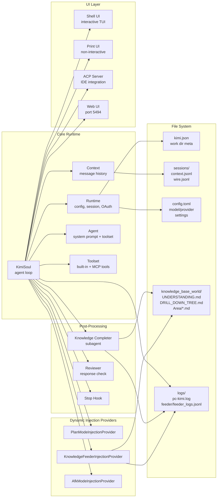
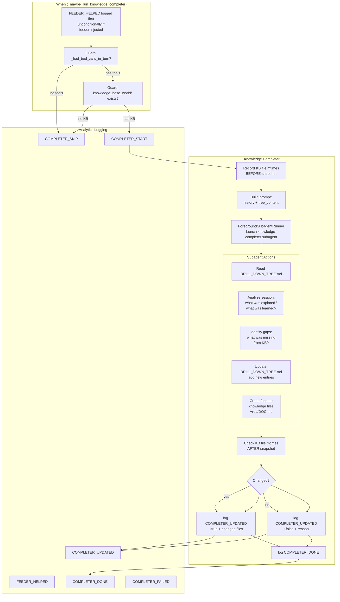
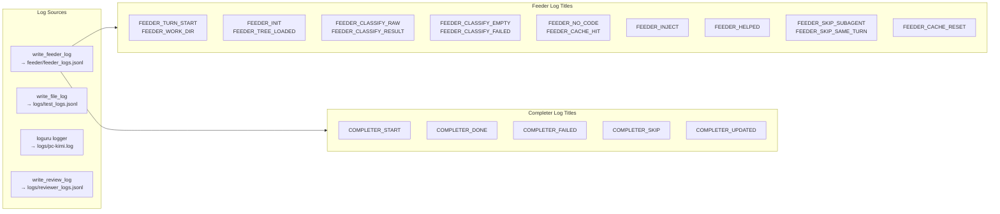
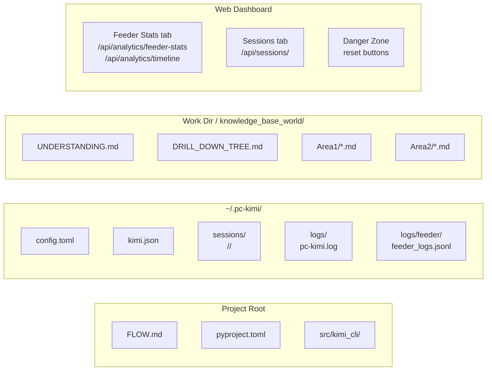
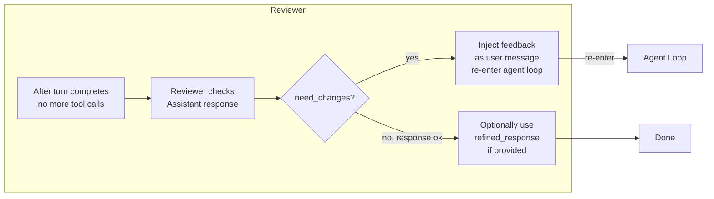

# System Architecture Flow

```mermaid
flowchart TB
    subgraph INIT["Startup & Init"]
        A1[CLI Entry] --> A2[Parse flags\n--session, --model, --agent...]
        A2 --> A3[Load Config\n~/.pc-kimi/config.toml]
        A3 --> A4{Session?}
        A4 -->|--session ID| A5[Session.find]
        A4 -->|--continue| A6[Session.continue_]
        A4 -->|none| A7[Session.create]
        A5 --> A8[Runtime.create]
        A6 --> A8
        A7 --> A8
        A8 --> A9[load_agent\nYAML + system prompt]
        A9 --> A10[Context.restore\nhistory from context.jsonl]
        A10 --> A11[KimiSoul created]
        A11 --> A12[Ready]
        A12 --> A13[First user turn triggers\nFeeder lazy init\nvia get_injections()]
    end
```

---

## User Request Flow

```mermaid
sequenceDiagram
    actor User
    participant CLI as Shell/Print UI
    participant Soul as KimiSoul
    participant Feeder as KnowledgeFeeder
    participant LLM as LLM Provider
    participant Tools as Toolset
    participant KB as knowledge_base_world/
    participant Compl as Completer

    User->>CLI: send message
    CLI->>Soul: run(user_input)
    
    rect rgb(40, 44, 52)
        Note over Soul,KB: PHASE 1: Slash / Hook
        Soul->>Soul: parse slash command?
        alt is slash command
            Soul->>CLI: execute command, return
        end
        Soul->>Soul: UserPromptSubmit hook
    end
    
    rect rgb(30, 50, 70)
        Note over Soul,KB: PHASE 2: Agent Turn
        Soul->>Soul: _turn() → _agent_loop() → _step()
        
        loop Each step
            Note over Soul: 2e.1 Notification delivery\n(pending background results)
            Soul->>Soul: 2e.2 DYNAMIC INJECTION
            Soul->>Feeder: _collect_injections()
            Feeder->>Feeder: get_injections(history)
            Feeder->>KB: [lazy init] if first call\ncreate knowledge_base_world/
            Feeder->>KB: read DRILL_DOWN_TREE.md
            Feeder->>Feeder: parse tree entries
            Feeder->>LLM: kosong.generate() classify
            LLM-->>Feeder: ["Todo/API.md"]
            Feeder->>KB: read → Read: files
            Feeder-->>Soul: [DynamicInjection]
            Soul->>Soul: wrap in <system-reminder>
            Soul->>Soul: 2e.3 normalize_history()
            
            Soul->>LLM: 2e.4 kosong.step(system_prompt, toolset, history)
            LLM-->>Soul: text or tool_calls
            
            alt has tool_calls
                Soul->>Tools: execute tools
                Tools-->>Soul: results
                Soul->>Soul: append to context (2e.5)
                Note over Soul: continue loop
            else no tool_calls
                Note over Soul: exit loop → TurnOutcome
            end
        end
    end
    
    rect rgb(50, 30, 30)
        Note over Soul,Compl: PHASE 3: Post-Turn
        Soul->>Soul: FEEDER_HELPED\nlog true/false\n(before completer guard)
        Soul->>Soul: _maybe_run_knowledge_completer()
        Soul->>Soul: Guard: _had_tool_calls_in_turn?
        alt no tool calls
            Soul->>Soul: log COMPLETER_SKIP
        else has tool calls + KB exists
            Soul->>+Compl: asyncio.create_task()\nfire-and-forget
            Note over Compl: runs in background\nuser sees response immediately
            Compl->>Compl: Record KB mtimes BEFORE
            Compl->>KB: read DRILL_DOWN_TREE.md
            Compl->>Compl: ForegroundSubagentRunner
            Compl->>Compl: launch knowledge-completer\nsubagent agent
            Compl->>KB: read/update knowledge files
            Compl->>KB: update DRILL_DOWN_TREE.md
            Compl->>Compl: Record KB mtimes AFTER
            Compl->>Compl: log COMPLETER_UPDATED\n+ true/false + reason
            Compl->>Compl: log COMPLETER_DONE
        end
    end
    
    rect rgb(30, 50, 30)
        Note over Soul,CLI: PHASE 4: Response
        Soul->>CLI: TurnEnd
        CLI-->>User: display result
    end
```



---

## Component Relationship Diagram



---

## Feeder Detailed Flow

```mermaid
flowchart TB
    subgraph TRIGGER["When"]
        T1[User sends message]
        T2[KimiSoul.run() called]
        T3[_turn() starts]
        T4[_agent_loop() starts]
        T5[_step() first iteration]
        T6[_collect_injections() called]
    end

    subgraph FEEDER["KnowledgeFeederInjectionProvider.get_injections()"]
        F1{soul.turn_id ==\nlast_turn_id?}
        F1 -->|yes, same turn| F2[return []]
        F1 -->|no, new turn| F3{is_root?}
        F3 -->|no| F4[return []]
        F3 -->|yes| F5[_ensure_init]\n[lazy] check/create\nknowledge_base_world/
        F5 --> F6{created?}
        F6 -->|failed| F7[return []]
        F6 -->|ok| F8[_load_tree]\nparse DRILL_DOWN_TREE.md
        F8 --> F9{entries > 0?}
        F9 -->|no| F10[return []]
        F9 -->|yes| F11[extract last\nuser message text]
        F11 --> F12{cache hit?\nsame text}
        F12 -->|yes| F13[return cached\ninjection]
        F12 -->|no| F14[_classify_relevance]
    end

    subgraph CLASSIFY["LLM Classification"]
        C1[Build prompt:\nuser_text + tree_content]
        C1 --> C2[kosong.generate()\nno tools, single call]
        C2 --> C3[Parse JSON response]
        C3 --> C4{valid JSON\narray?}
        C4 -->|yes| C5{matches > 0?}
        C5 -->|yes| C6[return entry paths]
        C5 -->|no| C7[return []]
        C4 -->|parse error| C8[log FEEDER_CLASSIFY_FAILED]
        C8 --> C7
    end

    subgraph READ["Read Code Files"]
        R1[For each matched entry]
        R1 --> R2[Look up → Read: paths]
        R2 --> R3[Resolve glob/file paths\nrelative to work_dir]
        R3 --> R4[Read file contents\ncap at 8 KiB total]
        R4 --> R5[Format as markdown\nwith code blocks]
    end

    subgraph INJECT["Injection"]
        I1[Build injection:\n\"IMPORTANT: files already read...\"]
        I1 --> I2[wrap in\n<system-reminder>]
        I2 --> I3[Append as user msg\nto context]
        I3 --> I4[normalize_history()\nmerges with original\nuser message]
        I4 --> I5[LLM sees combined\nuser_msg + knowledge]
    end

    TRIGGER --> FEEDER
    F14 --> CLASSIFY
    CLASSIFY -->|matched| READ
    CLASSIFY -->|empty| F10
    READ --> INJECT
```

---

## Completer Detailed Flow



---

## Log Pipeline



---

## Data Flow: Single Turn

```mermaid
flowchart TD
    U[User: WHERE IS TODO APIs?]
    
    subgraph Before["Before LLM"]
        B1[Feeder reads\nDRILL_DOWN_TREE.md\n(lazy init if first call)]
        B2[LLM classifies:\nTodo/API.md matches]
        B3[Reads: todo.controller.ts\ntodo.service.ts\ntodo.entity.ts]
        B4[Injects as\n<system-reminder>\nwith directive: Do NOT re-read]
    end

    subgraph LLM_CALL["LLM Call"]
        L1[System Prompt\n+ KIMI_WORK_DIR_LS\n+ KIMI_AGENTS_MD\n+ KIMI_SKILLS]
        L2[Context History\n+ merged knowledge]
        L3[Tools: ReadFile,\nGlob, Grep, WriteFile...]
        L1 --> L4[kosong.step]
        L2 --> L4
        L3 --> L4
    end

    subgraph After["After LLM"]
        A1{Has tool_calls?}
        A1 -->|yes| A2[Execute tools]
        A2 --> A3[Append results\nto context]
        A3 --> LLM_CALL
        A1 -->|no| A4[Return response\nto user]
        A4 --> A5[FEEDER_HELPED\n+ true if 0 exploration calls\n+ false if explored]
    end

    subgraph CompleterFlow["Post-Turn (fire-and-forget)"]
        CA{_had_tool_calls\n_in_turn?}
        CA -->|no| CB[COMPLETER_SKIP\nlog + return]
        CA -->|yes| CC{KB exists?}
        CC -->|no| CB
        CC -->|yes| CD[COMPLETER_START]
        CD --> CE[Record KB mtimes\nBEFORE]
        CE --> CF[Launch knowledge-completer\nsubagent]
        CF --> CG[Read/update\nKB files]
        CG --> CH[Record KB mtimes\nAFTER]
        CH --> CI[COMPLETER_UPDATED\n+ true/false]
        CI --> CJ[COMPLETER_DONE]
    end

    subgraph Response["User Sees"]
        R1["TurnEnd → \nThe Todo APIs are in..."]
    end

    U --> Before
    Before --> LLM_CALL
    LLM_CALL --> After
    A5 --> CompleterFlow
    A4 --> Response
```

---

## File Structure



---

## Reviewer Flow (Optional)



---

## Project Directory Map

```
src/kimi_cli/
├── cli/__init__.py          ← CLI entry, flag parsing, UI dispatch
├── app.py                   ← KimiCLI.create(), enable_logging()
├── config.py                ← Config loading/saving, model/provider setup
├── session.py               ← Session.create/find/continue, work dir meta
├── session_state.py          ← SessionState (plan mode, approval...)
├── agents/default/          ← Agent YAML specs + system prompts
│   ├── agent.yaml           ← Root agent (coder, explore, plan, knowledge-completer)
│   ├── system.md            ← System prompt template (Jinja2)
│   ├── coder.yaml           ← Subagent: coding tasks
│   ├── explore.yaml         ← Subagent: read-only exploration
│   ├── plan.yaml            ← Subagent: planning only
│   ├── knowledge-completer.yaml  ← Subagent: KB curator
│   └── knowledge-completer.md    ← System prompt for completer
├── soul/
│   ├── kimisoul.py          ← KimiSoul: run(), _turn(), _step(), _agent_loop()
│   ├── context.py           ← Message history, checkpoints, compaction
│   ├── agent.py             ← Runtime, Agent, load_agent()
│   ├── toolset.py           ← KimiToolset: tool loading, execution, dedup
│   ├── dynamic_injection.py ← DynamicInjection + DynamicInjectionProvider
│   ├── dynamic_injections/
│   │   ├── plan_mode.py     ← Plan mode reminders (READ-ONLY)
│   │   ├── afk_mode.py      ← AFK mode guidance
│   │   └── knowledge_feeder.py ← Knowledge Feeder (LLM classify + inject)
│   └── compaction.py        ← Context compaction when too large
├── tools/                   ← Built-in tools (ReadFile, WriteFile, Shell...)
├── subagents/
│   ├── runner.py            ← ForegroundSubagentRunner, run_soul_checked
│   ├── builder.py           ← SubagentBuilder (build agent from type def)
│   ├── core.py              ← prepare_soul()
│   └── store.py             ← SubagentStore (persist instance state)
├── web/
│   ├── app.py               ← FastAPI app factory, static file serving
│   ├── api/
│   │   ├── sessions.py      ← REST + WebSocket for sessions
│   │   ├── config.py        ← Config CRUD
│   │   └── analytics.py     ← Feeder/completer stats API + HTML page
│   └── static/index.html     ← SPA: Sessions + Feeder Stats tabs
└── utils/
    └── test_logger.py        ← write_file_log, write_review_log, write_feeder_log
```
